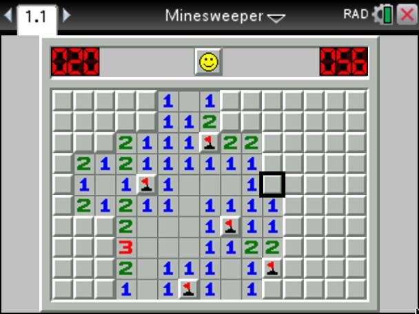
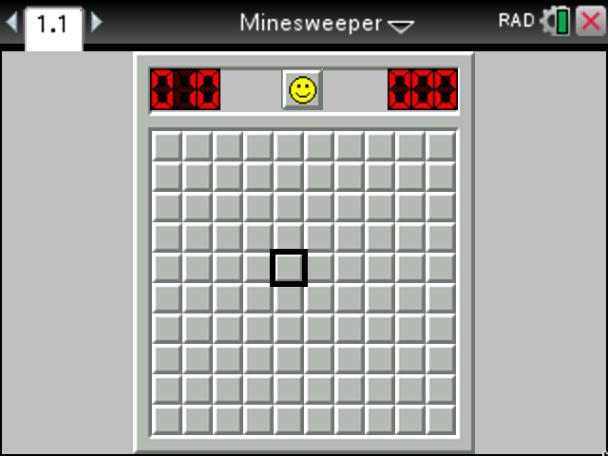
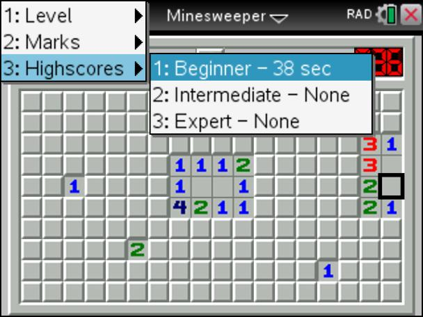

# TI-Nspire Minesweeper

A simple Minesweeper-Clone made for the TI-Nspire with Lua.

The images used are from the original Minesweeper Game. I don't own them.

**Warning:** This game is only tested on TI-Nspire CX and TI-Nspire CX CAS
(OS Version 4.5), so there might be bugs on other platforms.

# Screenshots

## Controls

| Key(s)                   | Action      |
|--------------------------|-------------|
| Arrow Keys / Number Keys | Move Cursor |
| Enter                    | Open Cell   |
| (-) / F                  | Flag Cell   |

Press menu to change difficulty or to enable/disable marks.

## How to play

The goal of this game is to open all cells.
If you open a cell with a mine, you loose!
The numbers on the cells tell you how many mines there are in the 8 adjacent cells.
Flag a cell if you are sure that there is a mine under it.

## How to Install

### .tns file from releases page

Download the `.tns` file from the latest release
[https://github.com/Skayo/TI-Nspire-Minesweeper/releases/latest](here) and copy
it to your calculator.

### Using Luna

Make sure you have Luna (https://github.com/ndless-nspire/Luna) and
TI-Resource-Merge (https://github.com/DaveDuck321/TI-Resource-Merge) installed.
The merge script should be in your PATH as `nspire-merge`.

**Note:** since API version 2.3 (OS version >=3.6), support for inline-images
like generated by the merge script was removed, so you would need to require
an older API version, if you are using these OS versions. You can use this dirty
fix in the merge script for that: https://github.com/alexcoder04/TI-Resource-Merge.

Run `make` and it will generate the `minesweeper.tns` file which can be loaded
onto the calculator.

### Manually

The resources files needed to build the project can be imported in the script
editor with their default names using the CX Student Software (every image in
the resource folder needs to be imported).

